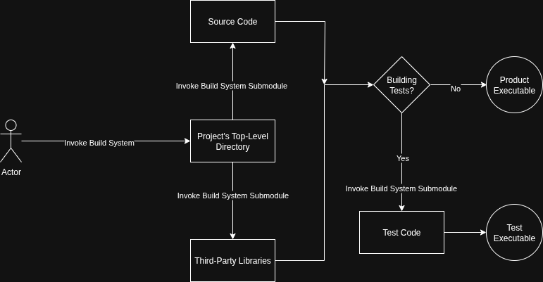

# Templates

## Table of Contents

* [About](#about)
* [Templates in Git](#templates-in-git)
    * [Important Links](#important-links)
    * [Template Repo without Template Feature](#template-repo-without-template-feature)
* [Leveraging Build Systems in Template Development](#leveraging-build-systems-in-template-development)

## About

DevOps and CI/CD is a relatively new and rapidly growing field of computer software engineering. One of the most promising and less-explored aspects of CI/CD is the concept of developing software **templates** that...

* ...contain all pre-requisite boilerplate code, project organization, and build system configuration needed to hit the ground running.

* ...are actively maintained and improved *separate* from the projects they are being used for.

* ...reduce or even eliminate the cognitive overhead of project extensibility through features like integration of third-party libraries, containerized and remote development, and automated testing.

The philosophy of the software engineer who develops a template is as follows:

*"Engineers are hired to solve a problem, and should not spend countless hours configuring their environment to solve said problem. Thus, environment configuration becomes a different problem for a different engineer to solve."*

## Templates in Git

Some clients, like GitHub, have a template functionality that let you create repositories from an existing template repository with the click of a button. In typical Microsoft fashion, **for some reason Azure doesn't support this.** Thankfully, we can still create and use a [template repo without a template feature](#template-repo-without-template-feature).

### Important Links
* [The repo I used from the demo](https://github.com/SFML/cmake-sfml-project) is a small and simple example of what we want
* [Recording of the demo in our google drive](https://drive.google.com/file/d/1XXPs7RTZxtv7ldOQVDBF58yk8XG6cT9-/view?usp=drive_link).
* As always, make sure to check [this directory's README](./README.md) for additional resources and help with pre-requisite knowledge.

### Template Repo without Template Feature

Here is a streamlined collection of commands for using a repo as a template if your Git client does not support templates.

```bash
git clone https://git@client.com:template # Clone url to template
cd template # Get into our template directory
rm -rf .git # Remove the repo
git init # Create our new .git
git add . # Add all of our template code to our new .git database
git commit -m "Initial commit"
git remote add origin https://git@client.com:project # Set our remote to the project repo that will be using the template. !!!This remote repo MUST exist and have NO prior commits!!!
git push -u origin main
```

## Leveraging Build Systems in Template Development

Without modern build system tools, no matter how flawed they might be, the benefit of programming templates would be, at best, negligible. Today, we have access to countless build system utilities to script the process of compiling binary or bytecode libraries and executables, including and (if necessary) linking libraries, running tests, and much more. This makes the use of build systems a no-brainer when developing robust, re-usable, and exstinsible templates.

### Build System Topology

