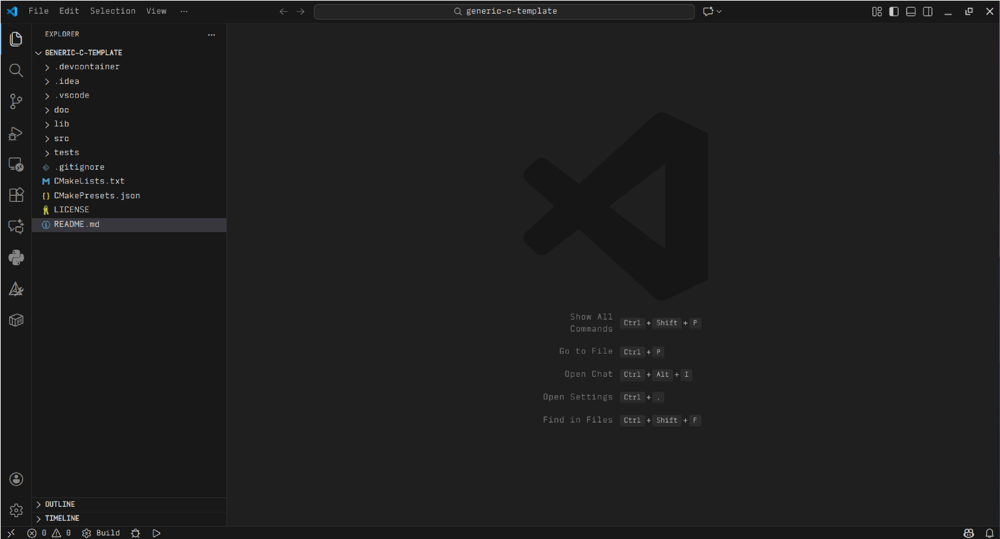
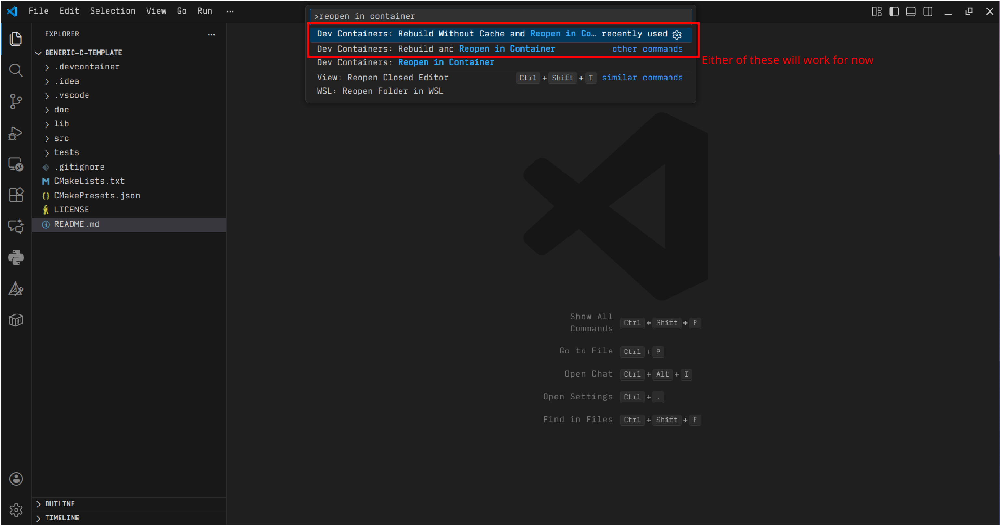
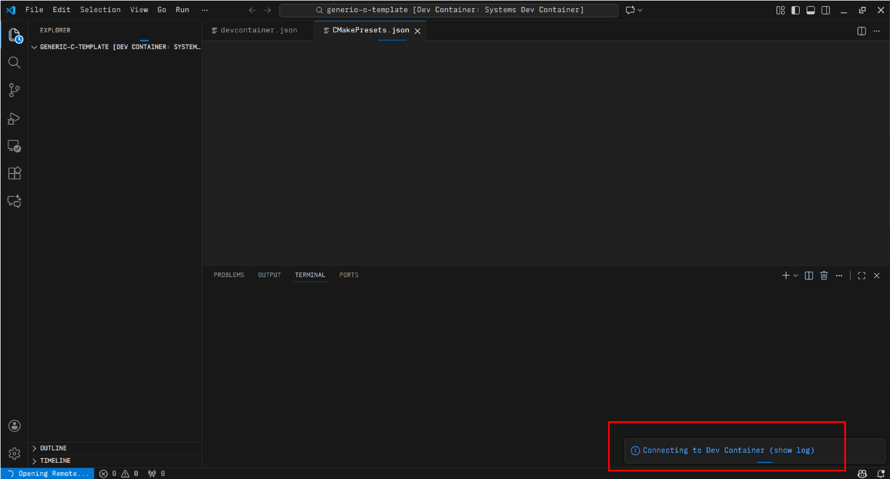
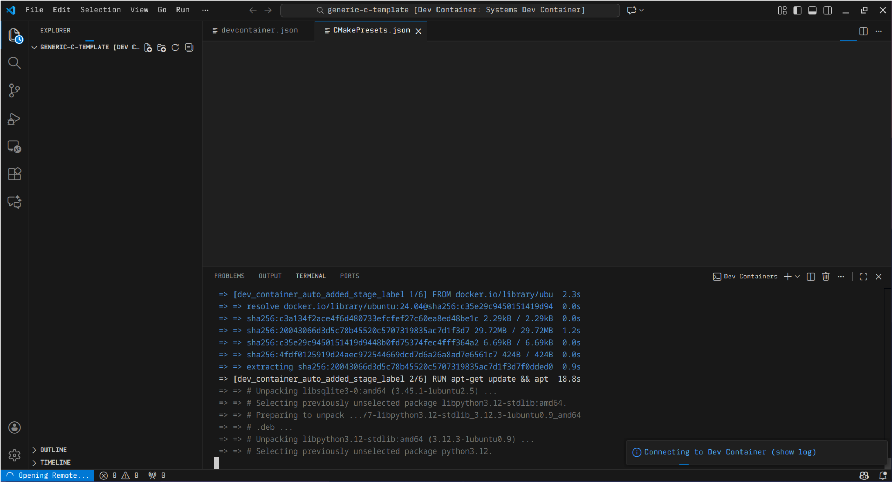
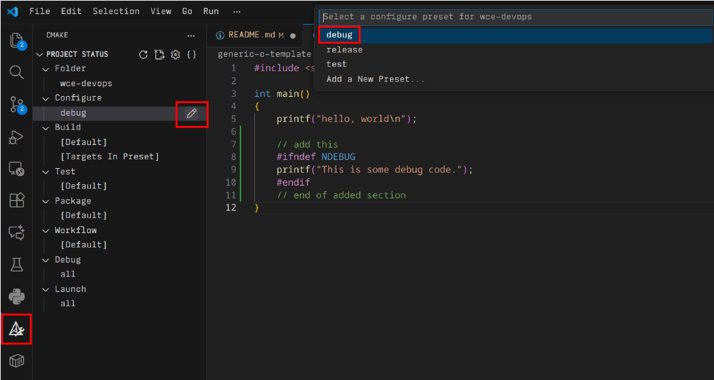
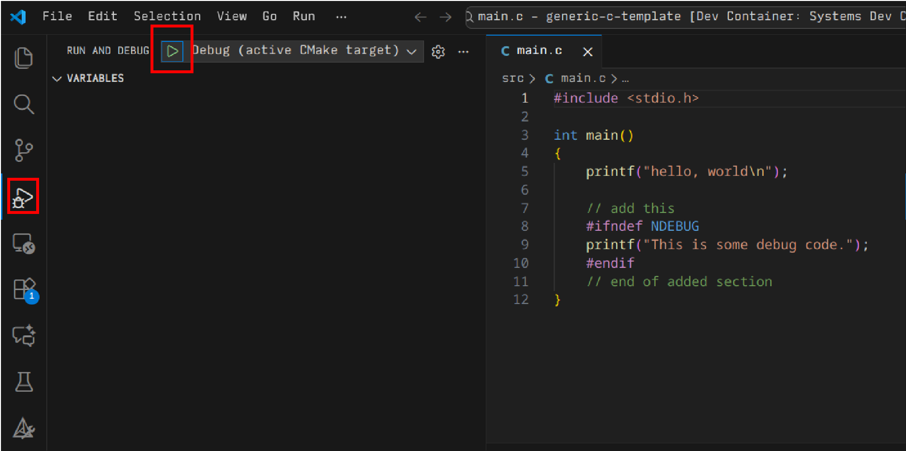
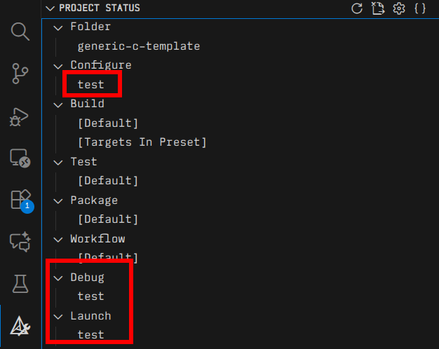

# Generic C Programming Template

## Table of Contents

* [About](#about)
* [Dependencies](#dependencies)
    * [Option 1: Out of the Box](#out-of-the-box)
    * [Option 2: Hands On](#hands-on)
* [Starting a New Project](#starting-a-new-project)
    * [Copying the Template Contents](#copying-the-template-contents)
    * [Getting Started in VSCode](#getting-started-in-vscode)
* [Writing Code](#writing-code)
    * [Debug Builds](#debug-builds)
    * [Release Builds](#release-builds)
    * [Test Builds](#test-builds)

## About

The *Generic C Programming Template* seeks to provide the user with an intuitive project structure fit for any IDE that is compatible with the [CMake build system](https://cmake.org/). The code itself offers a minimal project structure, complete with a third party unit testing library and minimal CMake configuration. The objective is to eliminate any sort of configuration overhead without limiting the opportunities for learning the low-level details of project building. Whether you are a beginner looking for out-of-the-box functionality, or an experienced user looking for an open-ended quickstart, This programming template promises to deliver a smooth experience.

## Dependencies

We know it's a pain to install a bunch of dependencies. If you want a streamlined and simplified development experience, see [Out of the Box](#out-of-the-box). If you like to keep things lightweight and more hands-on, see [Hands On](#hands-on).

### Out of the Box

* [Visual Studio Code](https://code.visualstudio.com/) is our code editor. Lightweight, highly customizeable, and easy to use. **After you install, you will need the below extensions**.
    * [Remote Development](https://marketplace.visualstudio.com/items?itemName=ms-vscode-remote.vscode-remote-extensionpack)
    * [Container Tools](https://marketplace.visualstudio.com/items?itemName=ms-azuretools.vscode-containers)
* [Docker](https://www.docker.com/) allows us to give you a precompiled list of dependencies and an environment configuration. It will install most, if not all of the tools that you need for your projects so that **you** don't have to.
* [WSL](https://learn.microsoft.com/en-us/windows/wsl/install) *or* [Git Bash](https://gitforwindows.org/), which are Git clients for windows. Git is not necessarily *required* to use our templates, but it is very helpful. Our engineers use Linux, so we are more comfortable writing bash utilities and thus **require this for anyone using Windows**. Don't worry, the Bash shell is incredibly important to learn anyways ;)

### Hands On

If you are an experienced user and you don't need all that bloated *filth* (just kidding!), then all you need is a C compiler and CMake. I trust you know what you're doing, so I'll only give an example with the [apt package manager](https://wiki.debian.org/Apt) for you Debian users out there.

```sh
sudo apt install -y build-essential cmake
```

## Starting a New Project

Starting a new project from this GitHub page is intuitive. This section assumes that you have Git installed and are using a Bash command line interface. If you aren't interested, you can just download the contents of this GitHub repo as a zip via the blue `<> Code` button on the repository homepage. Unzip it, and you can skip all the Git steps.

### Copying the Template Contents

1. Clone the `wce-devops` repo.

```sh
git clone https://github.com/ccgargantua/wce-devops
```

2. Create a project directory/folder.

```sh
mkdir /path/to/your/desired/project/folder/
```

3. Copy the contents of the `wce-devops/generic-c-template` to your new project directory.

```sh
cp -r wce-devops/generic-c-template/* /path/to/your/desired/project/folder/
```

4. Change into the project directory and open Visual Studio Code.

```sh
cd /path/to/your/desired/project/folder/
code .
```

### Getting Started in VSCode

If you followed the previous steps, you should now see the following screen.



The [command pallete](https://code.visualstudio.com/api/ux-guidelines/command-palette) is a powerful tool that we will use for a few steps in the process. For now, we will start by opening the code in the provided Docker container. Press `Shift + Ctrl/Cmd + P` to open the command palette, then type `Reopen in container`. You should see the following pop up.



When you select one of those, things will start to move around and you will have a popup that gives you the option to show the devcontainer log. I advise you to click that. If you run into issues, you should copy that log information and send it to us at wce@mtu.edu. However, the project should be open within the devcontainer and ready to use within ~5 minutes at most. **You will not have to wait 5 minutes every time you open the project**, just the first time you start the fresh devcontainer.




When it is done, the final few messages in the log are something like...

```
[69022 ms] Start: Run in container: /home/vscode/.vscode-server/bin/bf9252a2fb45be6893dd8870c0bf37e2e1766d61/node -e 
[69150 ms] Port forwarding 38298 > 36489 > 36489 stderr: Connection established
[75165 ms] Port forwarding 38298 > 36489 > 36489 stderr: Remote close
[75189 ms] Port forwarding 38298 > 36489 > 36489 terminated with code 0 and signal null.
```

If everything went smoothly, you are ready to code! Follow the below steps carefully to learn how to actually *use* the template to run the code, as well as helpful tools we have packed into it for you!

## Writing Code

Now, you are ready to write some code. When you write code, it's good to think about the code you write in three ways:

- *What code do I need for debugging?*
- *What will my code look like when I release a final product?*
- *How can I test my code?*

We provide you with a build and run configurations (optional ways to run your code) for debugging, release, and testing.

### Debug Builds

Open the file `src/main.c`. You will see a simple [Hello World](https://en.wikipedia.org/wiki/%22Hello,_World!%22_program) program. Now, imagine you are debugging some broken code, and you want to be able to print out a message that gives you some information about the program state. Place the following code into your `main.c`.

```c
#include <stdio.h>

int main()
{
	printf("hello, world\n");
    
    // add this
    #ifndef NDEBUG
    printf("This is some debug code.");
    #endif
    // end of added section
}
```

Save the file. **Note** if you are on Linux and you get a permissions error when trying to save the file, run the following on the host machine:

```sh
sudo chmod -R a+rwX /path/to/your/project/folder/
```

To run the debug build, you must first select the configuraiton by navigating to the CMake panel and selecting `debug` under "configure". Your target should be `program`.



Then, navigate to the Run pane and press the green "Play" button to compile and then run your software.




### Release Builds

Follow the steps for the debug build, but select the `release` configuration instead. Make sure your target is still `program` in the CMake pane.

If you run the release build, notice that the debug print does not execute ;) You can test this with an `#else` directive.

```c
#include <stdio.h>

int main()
{
	printf("hello, world\n");
    
    // add this
    #ifndef NDEBUG
    printf("This is some debug code.\n");
    #else
    printf("But this isn't!\n");
    #endif
    // end of added section
}
```

### Test Builds

Follow the same steps as debug and release builds, but select the `test` configuration **and select the `test` target**.



When you run the tests, you'll notice that, by default, a single passing test runs. See [Adding Tests](#adding-tests) to learn how to add your own tests.
